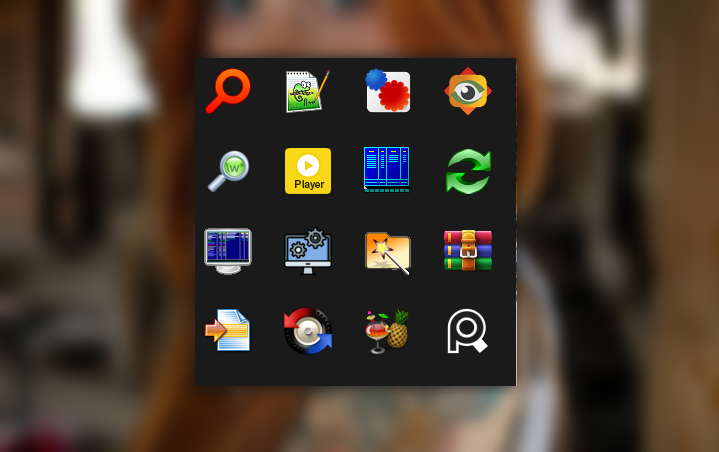
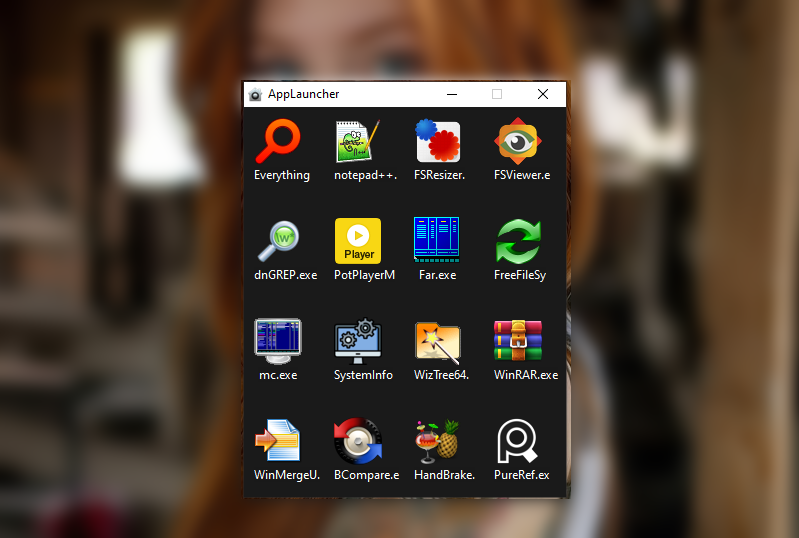
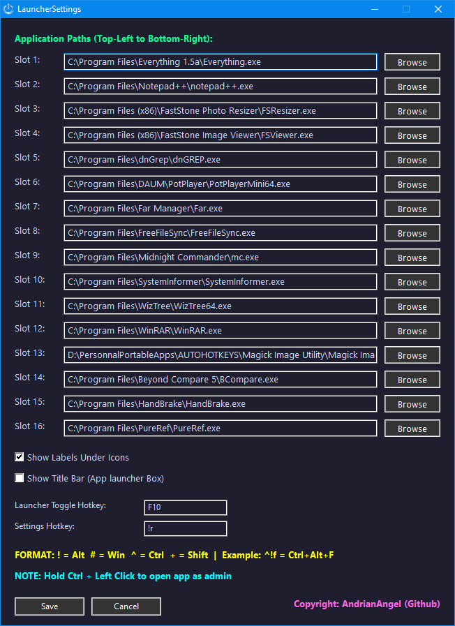
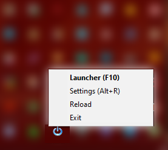

___

### 🎯 QUICK APPS LAUNCHER PRO
___

> A lightweight **AutoHotkey-powered** application launcher for Windows.  
> Assign up to **16 apps** to icon slots and launch them instantly from a sleek dark overlay or your system tray.

---

## 📥 Download

| Version | File |
|--------|------|
| ✅ Windows 64-bit | `QuickAppsLauncherPro_x64.exe` |
| ✅ Windows 32-bit | `QuickAppsLauncherPro_x86.exe` |
| 📦 ZIP (includes exe) | `QuickAppsLauncherPro_x64.zip` / `QuickAppsLauncherPro_x86.zip` |

> **No installation required.** Just run the `.exe`. Settings are saved automatically in `LauncherSettings.ini` next to the exe.

---

## 📁 Launcher — No Title Bar

---

## 📁 Launcher — With Title Bar

The launcher displays a **4×4 grid** of app slots in a compact dark-themed overlay.  
Toggle the title bar on or off from Settings to suit your style.

- **Click** a slot → Launch the app normally
- **Left Ctrl + Click** → Launch as **Administrator**
- **Right Ctrl + Click** → Open the **app's folder location**
- Empty slots show a `+` placeholder with a prompt to assign an app

---

## 🔗 Settings

Open Settings with `Alt+R` (or your custom hotkey) to configure:

- 📂 **Slots 1–16** — Browse or type the path to any `.exe` per slot
- 🏷️ **Show Labels Under Icons** — Toggle short filename labels below each icon
- 🪟 **Show Title Bar** — Toggle the launcher window title bar
- 🎹 **Launcher Toggle Hotkey** — Default: `F10`
- 🎹 **Settings Hotkey** — Default: `Alt+R`

**Hotkey symbol reference:**

| Symbol | Key |
|--------|-----|
| `!` | Alt |
| `#` | Win |
| `^` | Ctrl |
| `+` | Shift |

> Example: `^!f` = `Ctrl+Alt+F`

---

## ✅ Tray Menu

Right-click the system tray icon for quick access:

- **Launcher (F10)** — Open/close the app grid overlay
- **Settings (Alt+R)** — Open the settings panel
- **Reload** — Restart the script to apply changes
- **Exit** — Close the application

---

## ⚙️ How It Works

1. Run the `.exe` — it starts silently in the system tray
2. Press `Alt+R` to open Settings and assign apps to slots
3. Press **Save** — hotkeys activate immediately
4. Press `F10` to open the launcher grid and click any app to launch it

---

## 📄 License

© AndrianAngel (Github) — All rights reserved.
